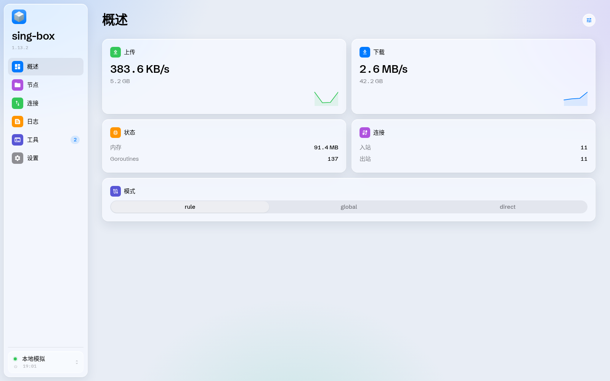
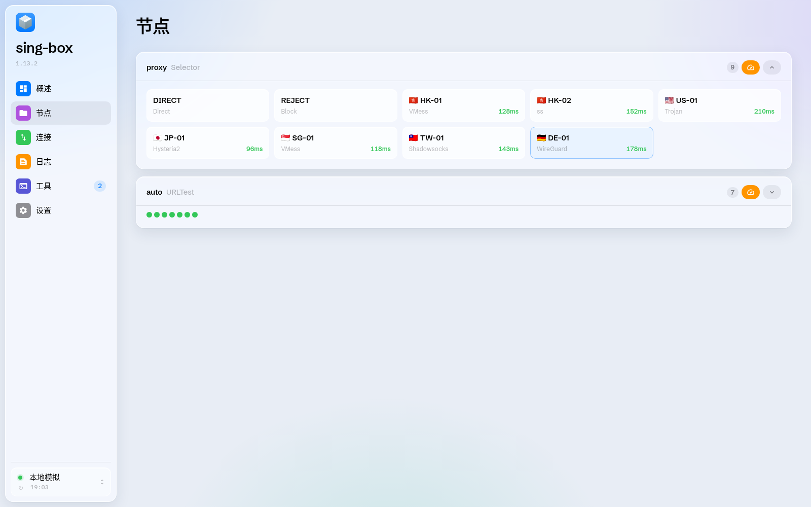
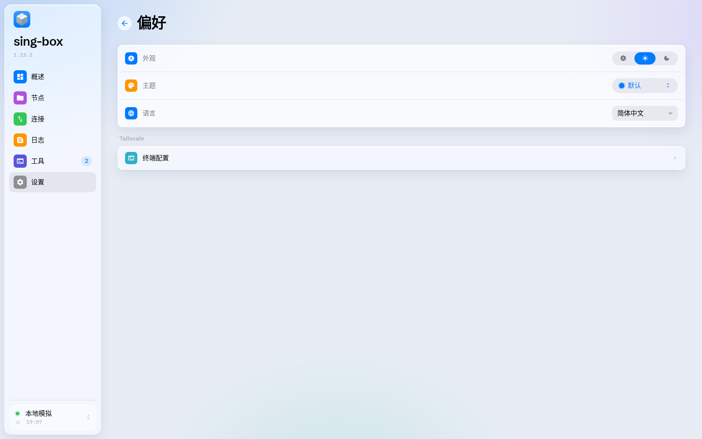

# muscboard

An unofficial, deeply customized fork of
[SagerNet/sing-box-dashboard](https://github.com/SagerNet/sing-box-dashboard) —
the web dashboard for [sing-box](https://sing-box.sagernet.org).

All credit for the original project goes to its author
[nekohasekai](https://github.com/nekohasekai) / the SagerNet team.
This project is a derivative work and is **not** affiliated with or endorsed
by the original authors.

## Screenshots







## Customizations

- Frosted-glass dashboard on a quiet atmospheric canvas: sidebar and
  content cards share the same material, with page-in and hover lift
  (no Dock magnification, no candy gradients).
- System Blue as the default accent; Settings-style solid icon tiles
  (upload green, download blue, speed-test orange) instead of candy
  gradients. Switches, segmented controls and capsules follow iOS.
- A pure-CSS isometric cardboard-box logo replaces the original "S" mark
  in the sidebar, mobile top bar and setup screen.
- Floating inset sidebar with a single fill for the selected row; server
  picker is a quiet account-style cell rather than a gradient CTA.
- Large-title metrics on Overview; proxy "Groups" renamed to
  "节点 / 節點" in Simplified/Traditional Chinese.

## Keeping in sync with upstream

The repository keeps the full upstream commit history, so pulling newer
upstream changes is a normal merge:

```sh
git fetch origin
git merge origin/main
# or: git pull origin main
```

Resolve any conflicts (customization work is concentrated in
`src/styles/globals.css`, `src/styles/shared.css` and the view CSS modules),
then commit and push:

```sh
git push
```

Tip: if upstream rewrites a lot, keep your customizations in dedicated
commits (or a dedicated branch) so each upstream merge is easier to review.

## LICENSE

```
Copyright (C) 2022 by nekohasekai <contact-sagernet@sekai.icu>

This program is free software: you can redistribute it and/or modify
it under the terms of the GNU General Public License as published by
the Free Software Foundation, either version 3 of the License, or
(at your option) any later version.

This program is distributed in the hope that it will be useful,
but WITHOUT ANY WARRANTY; without even the implied warranty of
MERCHANTABILITY or FITNESS FOR A PARTICULAR PURPOSE.  See the
GNU General Public License for more details.

You should have received a copy of the GNU General Public License
along with this program. If not, see <http://www.gnu.org/licenses/>.

In addition, no derivative work may use the name or imply association
with this application without prior consent.
```
